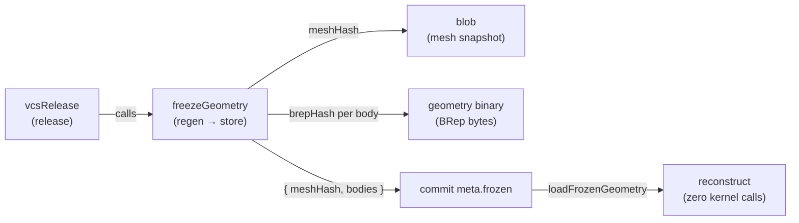

# vcsFreeze — Geometry Freeze Factory (makeFreeze)

> **System** ▸ [Overview](../../00-overview.md) ▸ [VCS](../00-overview.md) ▸ [Freeze Geometry](../freeze-geometry.md) ▸ **vcsFreeze**
> Related: [cadFreezeService](./cadFreezeService.md) · [assemblyFreezeService](./assemblyFreezeService.md) · [vcsRelease](./vcsRelease.md) · [Architecture: unified bindings](../../architecture/unified-vcs-bindings.md)

---

## Requirements

Requirements governed by [Freeze Geometry](../freeze-geometry.md).

| REQ | Status | Summary |
|-----|--------|---------|
| 684 | unapproved | On release: regenerate and store each body's BRep and mesh as immutable content-addressed objects |
| 685 | unapproved | Checking out a released commit reconstructs geometry with zero kernel calls |

### REQ 684 — Geometry freeze on release

- **Description:** On release, the system shall regenerate the model and store each resulting body's geometry (boundary representation and renderable mesh snapshot) as immutable content-addressed objects linked from the commit's metadata, so the release geometry never changes even if the kernel is later upgraded.
- **Rationale:** The BRep cache is evictable and the kernel changes between versions; freezing geometry on release makes a released revision's 3D output identical every time it is opened.
- **Verification:** Integration test (kernel stubbed): on freeze, per-body BReps are stored as content-addressed geometry objects and the mesh snapshot is stored as a blob.
- **Validation:** A released revision's 3D geometry never changes, even after the kernel is upgraded.

---

## Succinct description

A written-once factory (`makeFreeze`) that stores and retrieves frozen geometry for any type of released document; CAD and assembly bind it by supplying their own regeneration, snapshot, and reconstruction callbacks.

## How it works — for everyone (non-technical)

When a revision is officially released, the exact 3D geometry is photographed and stored permanently. From that point on, opening that released version loads the stored photograph rather than regenerating the geometry from scratch. This means the released part always looks exactly as it did when it was approved — even if the tools that build the geometry are later upgraded.

## How it works — in detail (technical)

`backend/services/vcs/vcsFreeze.js` exports `makeFreeze(binding)`.

### Binding contract

```js
{
  regen(model, { kernelClient, db }),   // async → geometry { bodies:[{id, brep, ...}], ... }
  snapshot(geometry),                   // → JSON-serializable mesh snapshot (no BReps)
  reconstruct(snapshot, brepByBody),    // → full renderable geometry with BReps merged back
}
```

### Returned operations

| Function | Description |
|---|---|
| `freezeGeometry(repo, model, {kernelClient}, db)` | Regenerate → store mesh snapshot as a blob → store each body's BRep as a binary object → return `{ meshHash, bodies:[{bodyId, brepHash}] }` |
| `loadFrozenGeometry(repo, frozen, db)` | Read mesh blob and each body's BRep bytes → call `binding.reconstruct` |
| `geometryForCommit(repo, model, commitHash, {kernelClient}, db)` | If `commit.meta.frozen` exists → `loadFrozenGeometry`; otherwise → `binding.regen` |

### Storage layout

The `{ meshHash, bodies }` object returned by `freezeGeometry` is embedded directly in the commit's `meta.frozen` field by `vcsRelease`. That is how `geometryForCommit` decides whether to reconstruct or regenerate.



BReps are stored via `vcs.putBinary` (REQ 675); the mesh snapshot is stored via `vcs.writeBlob`. Both are content-addressed, so identical geometry across revisions deduplicates automatically.

## Key files

- `backend/services/vcs/vcsFreeze.js` — `makeFreeze`
- `backend/services/vcs/cadFreezeService.js` — CAD binding (`meshSnapshot`, `cadRegen`)
- `backend/services/vcs/assemblyFreezeService.js` — assembly binding (`assemblySnapshot`, `assemblyRegen`)
