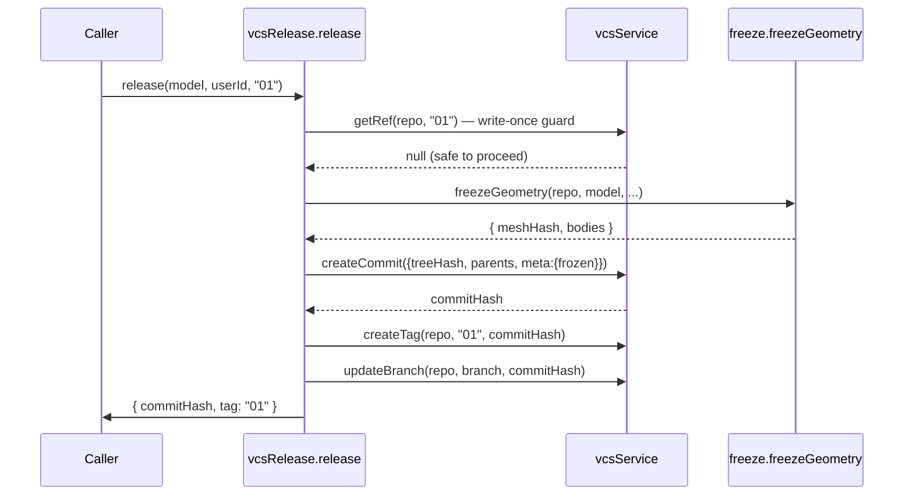

# vcsRelease — Release Factory (makeRelease)

> **System** ▸ [Overview](../../00-overview.md) ▸ [VCS](../00-overview.md) ▸ [Release and Revisions](../release-revisions.md) ▸ **vcsRelease**
> Related: [vcsFreeze](./vcsFreeze.md) · [cadVcsService](./cadVcsService.md) · [assemblyVcsService](./assemblyVcsService.md) · [Architecture: unified bindings](../../architecture/unified-vcs-bindings.md)

---

## Requirements

Requirements governed by [Release and Revisions](../release-revisions.md).

| REQ | Status | Summary |
|-----|--------|---------|
| 715 | unapproved | Design must be checked in before releasing |
| 716 | unapproved | Development release is self-service (cad.write only) |
| 717 | unapproved | Dev release freezes geometry and creates a write-once version tag |
| 737 | unapproved | Draft branch self-service release onto main |
| 746 | unapproved | Branch commit history preserved as ancestors of main on release |

### REQ 717 — Write-once release tag

- **Description:** A development release shall commit and freeze the working copy and fix the current numeric revision as a write-once version-control tag on that commit, so the frozen geometry and the commit hash are permanently associated with the revision identifier.
- **Rationale:** Freezing and a write-once tag make the released geometry immutable and reproducible without the live kernel.
- **Verification:** Integration test: after release, the numeric revision tag exists and re-release attempts return 409.
- **Validation:** After a development release the numeric revision tag exists and is immutable.

---

## Succinct description

A written-once factory (`makeRelease`) that performs the atomic "serialize → freeze → tag → advance branch" release operation for any version-controlled document type.

## How it works — for everyone (non-technical)

Releasing a design is like stamping a wax seal on a document. This factory writes the single procedure that: saves the final snapshot, stores the exact 3D geometry permanently, sticks an immutable label on it naming the revision, and advances the official line. The seal cannot be replaced — if the same revision label is attempted twice, the second attempt is rejected before anything is written.

## How it works — in detail (technical)

`backend/services/vcs/vcsRelease.js` exports `makeRelease(binding)`.

### Binding contract

```js
{
  repoFor(model, db),
  serialize(repo, doc, db),      // cadSerialize | assemblySerialize
  docOf(model),
  freeze,                        // { freezeGeometry(repo, model, opts, db) }
  commitMeta(),                  // namingVersion, kernelVersion, etc.
}
```

### `release(model, userId, revisionLabel, {kernelClient, at, parents}, db)`

Steps, in order:

1. **Write-once guard** — check `vcs.getRef(repo, tag)` first. If the tag already exists, throw `RestError(409)` before writing anything. This is the race-safe check that prevents double-release from orphaning a duplicate commit.
2. Serialize the working doc to a tree hash.
3. Freeze geometry → `{ meshHash, bodies }` (via `binding.freeze.freezeGeometry`).
4. Create a commit with `meta = { ...commitMeta, frozen }`. The optional `parents` override lets a branch release chain off the branch's own head commits rather than the main head, so the branch's commit history becomes ancestors of main (REQ 746).
5. **Claim the tag before advancing the branch** — `createTag` first, then `updateBranch`. A race that fails between these two steps leaves only a harmless unreachable commit; the tag is the immutable record.
6. Update `model.baseCommitHash = commitHash; dirty = false`.



The caller (`cadVcsService.devRelease` or the production release path) is responsible for setting `releaseLocked = true` and locking the `Part` row — those are outside `vcsRelease`'s scope.

## Key files

- `backend/services/vcs/vcsRelease.js` — `makeRelease`
- `backend/services/vcs/cadVcsService.js` — CAD binding + `devRelease`
- `backend/services/vcs/assemblyVcsService.js` — assembly binding
