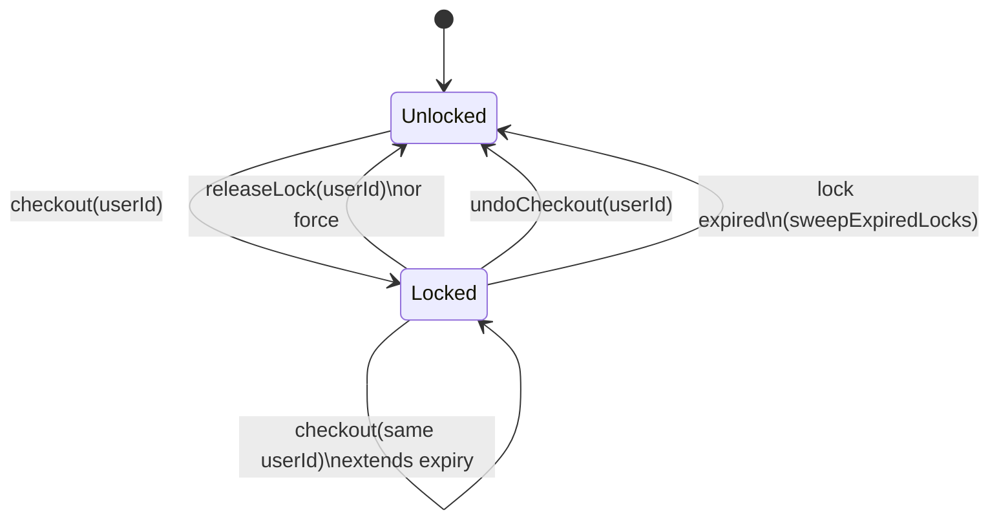

# vcsWorkingCopy — Working-Copy Factory (makeWorkingCopy)

> **System** ▸ [Overview](../../00-overview.md) ▸ [VCS](../00-overview.md) ▸ [Working Copy / Check-out / Check-in](../working-copy-checkout-checkin.md) ▸ **vcsWorkingCopy**
> Related: [cadVcsService](./cadVcsService.md) · [assemblyVcsService](./assemblyVcsService.md) · [vcsService](./vcsService.md) · [Architecture: unified bindings](../../architecture/unified-vcs-bindings.md)

---

## Requirements

| REQ | Status | Summary |
|-----|--------|---------|
| 677 | unapproved | Working copy binds to a checked-out branch |
| 678 | unapproved | Checkout acquires an exclusive per-branch lock |
| 679 | unapproved | Lock expires, is releasable, and is force-releasable by admins |
| 680 | unapproved | Check-in requires the lock; creates a commit advancing the branch |
| 681 | unapproved | Autosave persists edits without creating commits |
| 725 | unapproved | Undo checkout — discard uncommitted changes and release lock |

### REQ 678 — Exclusive checkout lock

- **Description:** Checkout shall acquire an exclusive lock on the branch for the requesting user. While another user holds the lock, the system shall reject checkout attempts with HTTP 423 and report the lock holder's name.
- **Rationale:** Without locks, two editors on one model silently overwrite each other. PDM-style exclusive checkout is the standard pattern for controlled CAD revision.
- **Verification:** Integration test: a second user is blocked with status 423 while the lock is held.
- **Validation:** Two users cannot unknowingly clobber each other's edits; the second sees who holds the model.

### REQ 680 — Check-in

- **Description:** Check-in shall require the lock and a commit message, serialize the working copy into the object store, create a commit chained to the prior head, advance the branch ref, and clear the dirty flag.
- **Rationale:** Check-in is the explicit, named snapshot operation; requiring the lock prevents concurrent commits; chaining to the prior head preserves linear history on each branch.
- **Verification:** Integration test: check-in requires the lock, creates a commit chained to the prior head, advances the branch ref, and clears dirty.
- **Validation:** A user saves a named version of their model that appears in history.

---

## Succinct description

A written-once factory (`makeWorkingCopy`) that produces the checkout / lock / check-in / undo / history operations for any version-controlled document; CAD and assembly bind it by supplying a thin `binding` object.

## How it works — for everyone (non-technical)

This is the single set of rules for how "checking a design out" and "checking it back in" works. Those rules are identical whether you are working on a 3D part or a full assembly — only the specifics of what the document contains differ. Rather than writing the same rules twice, the factory writes them once and lets each document type plug in just its own shape.

## How it works — in detail (technical)

`backend/services/vcs/vcsWorkingCopy.js` exports `makeWorkingCopy(binding)`.

### Binding contract

```js
{
  noun,                        // 'model' | 'assembly' (used in error messages)
  repoFor(model, db),          // async → { repoType, repoId }
  docOf(model),                // → serializable doc extracted from the working-copy row
  serialize(repo, doc, db),    // async → treeHash
  deserialize(repo, hash, db), // async → doc
  applyDoc(model, doc),        // → partial update object for model.update()
  commitMeta?(),               // optional metadata embedded in every commit
}
```

### Returned operations

| Function | Description |
|---|---|
| `seedMain(model, userId, opts, db)` | Commit the current doc to `main` with no parent; no-op if `main` already exists |
| `checkout(model, userId, opts, db)` | Acquire the lock (or extend if already held by the same user); update `baseCommitHash` from the branch head |
| `releaseLock(model, userId, opts, db)` | Release the lock; `force=true` allows an admin to release a lock they don't hold |
| `undoCheckout(model, userId, db)` | Roll working-copy doc back to `baseCommitHash` and release the lock |
| `checkin(model, userId, message, opts, db)` | Serialize doc → tree → commit → advance branch; clear `dirty` |
| `history(model, db)` | Ordered commit log for the working copy's current branch |
| `lockHeldByOther(model, userId, at)` | Sync predicate: true when a non-expired lock is held by a different user |

### Lock lifecycle



The default TTL is `CAD_LOCK_TTL_MS` env var or 30 minutes.

`checkin` does NOT release the lock — the user must call `releaseLock` separately (or the editor does so after the check-in UI flow).

## Key files

- `backend/services/vcs/vcsWorkingCopy.js` — `makeWorkingCopy`, `DEFAULT_LOCK_TTL_MS`
- `backend/services/vcs/cadVcsService.js` — CAD binding
- `backend/services/vcs/assemblyVcsService.js` — assembly binding
