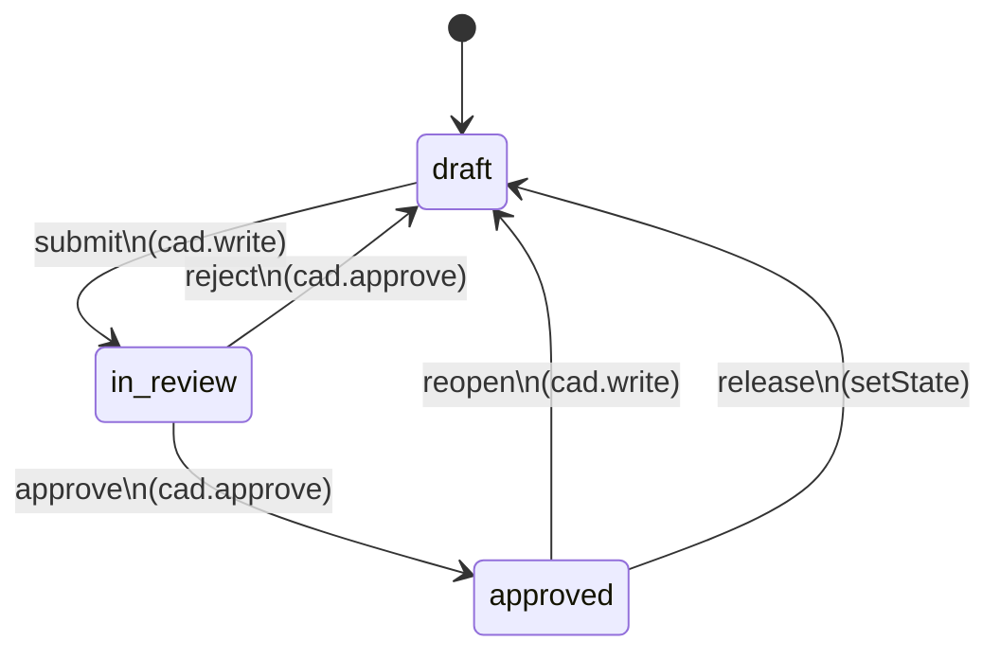

# workflowEngine — Generic Declarative Workflow Engine

> **System** ▸ [Overview](../../00-overview.md) ▸ [VCS](../00-overview.md) ▸ [Workflow and Review](../workflow-review.md) ▸ **workflowEngine**
> Related: [cadVcsService](./cadVcsService.md) · [assemblyVcsService](./assemblyVcsService.md) · [vcsService](./vcsService.md)

---

## Requirements

| REQ | Status | Summary |
|-----|--------|---------|
| 703 | unapproved | Generic declarative workflow engine with permission-guarded state transitions |
| 704 | unapproved | CAD workflow: draft → in_review → approved (submit/approve/reject/reopen) |
| 705 | unapproved | Release requires workflow state `approved`; after release, resets to `draft` |
| 706 | unapproved | Workflow transitions fire best-effort notification events |
| 739 | unapproved | Workflow state is tracked per branch (keyed by lineage root + branch name) |

### REQ 703 — Generic declarative workflow engine

- **Description:** The system shall provide a generic, declarative workflow engine that drives permission-guarded state transitions defined in a table; adding a new entity's workflow is done by adding a table entry, with no code changes to the engine.
- **Rationale:** A reusable declarative engine replaces ad-hoc per-entity state columns and can later govern other controlled-document types with the same permission infrastructure.
- **Verification:** Unit test: declarative transition table drives state changes; state persists per repo; defaults to `initial` state.
- **Validation:** Workflow behaviour is defined in one declarative place and reused across entities.

### REQ 739 — Per-branch workflow state

- **Description:** CAD review workflow state shall be tracked per branch (keyed by lineage root and branch name) so multiple draft branches can be in review independently, and `main` keeps its own production-approval cycle.
- **Rationale:** Workflow state is part of the branch, not the repository root — different drafts may be at different stages simultaneously.
- **Verification:** Route test: each branch's workflow state is independent; transitioning one does not affect another.
- **Validation:** Two concurrent draft branches can each be in `in_review` independently.

---

## Succinct description

A generic, declarative state-machine engine that drives permission-checked workflow transitions for any version-controlled document; CAD and assembly both use the same `CAD_WORKFLOW` definition stored per `(repoType, repoId)` in `VcsWorkflowState`.

## How it works — for everyone (non-technical)

This is the approval rulebook. It contains a table saying "from state A, a user with permission P can move to state B." It does not know about CAD or assemblies — it just enforces the table. Adding a new type of reviewable document means adding one entry to the table. The rulebook also sends a notification (best-effort) whenever a transition happens, so reviewers know when something is waiting for them.

## How it works — in detail (technical)

`backend/services/vcs/workflowEngine.js` is a pure infrastructure module — no serialization, no VCS objects, no document-specific logic.

### Transition table

```js
const CAD_WORKFLOW = {
  initial: 'draft',
  states: ['draft', 'in_review', 'approved'],
  transitions: [
    { action: 'submit',  from: 'draft',     to: 'in_review', permission: 'cad.write',   notify: 'reviewers' },
    { action: 'approve', from: 'in_review', to: 'approved',  permission: 'cad.approve', notify: 'author'    },
    { action: 'reject',  from: 'in_review', to: 'draft',     permission: 'cad.approve', notify: 'author'    },
    { action: 'reopen',  from: 'approved',  to: 'draft',     permission: 'cad.write'                        },
  ],
};
const WORKFLOWS = { cad: CAD_WORKFLOW, assembly: CAD_WORKFLOW };
```

Both CAD and assembly use `CAD_WORKFLOW`. Adding a new workflow type = adding a key to `WORKFLOWS`.

### Repo key (REQ 739)

State is stored in `VcsWorkflowState` keyed by `(repoType, repoId)`. Controllers compose `repoId = "<lineageRoot>:<branchName>"` so that each branch has independent workflow state. The engine itself is agnostic to this composition — it treats `repoId` as an opaque string.

### Exported functions

| Function | Description |
|---|---|
| `getState(repo, db)` | Returns current state; defaults to `workflow.initial` if no row exists |
| `setState(repo, state, userId, db)` | Upsert — used by release to reset to `draft` after releasing |
| `availableActions(repo, userId, db)` | Returns `[{action, to}]` filtered to transitions matching the current state and the user's effective permissions |
| `transition(repo, action, userId, ctx, db)` | Validate state (409 if invalid), check permission (403 if lacking), advance state, fire notify hook best-effort |
| `canRelease(repo, db)` | Convenience predicate: `state === 'approved'` |
| `setNotifier(fn)` | Replaces the notification hook (for testing) |

### State machine diagram



### Notification hook

`_defaultNotifier` sends a web push to the `authorUserID` on `approve` and `reject`. The `'reviewers'` notify type (on `submit`) is a stub — notifying all `cad.approve` holders is a hook point. A throwing notifier never fails the transition (REQ 706).

## Key files

- `backend/services/vcs/workflowEngine.js` — `WORKFLOWS`, `getState`, `setState`, `availableActions`, `transition`, `canRelease`, `setNotifier`
- `backend/models/vcs/vcsWorkflowState.js` — persistence model
- `backend/middleware/checkPermission.js` — `loadEffectivePermissions` (permission check)
