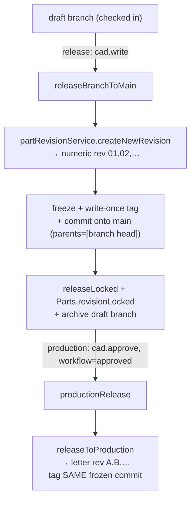

# Release & Revisions

> **System** ▸ [Overview](../00-overview.md) ▸ [VCS](../30-vcs.md) ▸ **Release & revisions**
> Related: [VCS subsystem map](./00-overview.md) · [Freeze geometry](./freeze-geometry.md) · [Branches](./branches.md) · [Workflow & review](./workflow-review.md)

---

## Requirements

| REQ | Status | Summary |
|-----|--------|---------|
| 686 | unapproved | Released commit corresponds to a Part revision (write-once tag named for the revision) |
| 687 | unapproved | No CAD-specific revision id; `Parts.revision` is the single revision identity |
| 715 | unapproved | Must be checked in (dirty=false + base commit) before release |
| 716 | unapproved | Development release self-service (cad.write, no approval) |
| 717 | unapproved | Dev release commits + freezes + write-once-tags the numeric revision |
| 718 | unapproved | After dev release the design and Part revision lock read-only |
| 719 | unapproved | Dev release produces STL + STEP from frozen geometry (no live regen) |
| 720 | unapproved | Editing a released design = new revision (next numeric, copies the doc) |
| 721 | unapproved | Production release from a dev-released design; requires approval (cad.approve) |
| 722 | unapproved | Production release = next letter revision, same geometry, freezes/tags, locks source |
| 723 | unapproved | STL via OCCT `exportStl`; STEP via `exportStep` |
| 724 | unapproved | History continuous across dev and production revisions (lineage-root repo) |
| 737 | unapproved | Draft branch released onto main self-service: mint numeric rev, advance/lock/archive |
| 740 | unapproved | Production release mints next letter revision tagging the same frozen commit (approval) |
| 746 | unapproved | Branch release preserves branch commits as ancestors of main (git-style, not squashed) |
| 553 | unapproved | When the user requests a new revision of a released CAD model, the system shall create a |
| 554 | unapproved | Each CAD model shall progress through a releaseState lifecycle of draft → review → relea |
| 557 | unapproved | The system shall allow soft deletion (activeFlag=false) of a CAD model only while its re |

### REQ 686 — Release ⇄ Part revision

- **Description:** A released CAD commit shall correspond to a Part revision: releasing shall tag the commit with the Part's revision identifier and record the mapping between the Part revision and the commit.
- **Rationale:** Unifies CAD versioning with the manufacturing revision the rest of the system depends on (BOM, barcodes, work orders), so the geometry of a given revision is unambiguous.
- **Verification:** Release commits the working copy, freezes its geometry, and creates a write-once tag named for `Parts.revision`.
- **Validation:** A user can find exactly which committed model was released as a given Part revision.

### REQ 737 — Self-service branch release onto main

- **Description:** A draft branch shall be released onto main self-service (requiring only cad.write, no review/approval step): mint the next numeric Part revision, advance main to the branch work, freeze and write-once-tag it, lock the Part read-only, and archive the draft branch. The review/approval workflow gates the separate production-letter release, not the numeric release onto main.
- **Rationale:** Releasing a branch onto main is how branch work becomes a released revision while keeping main as the single released line.
- **Verification:** Release establishes rev 01, locks the part, archives the branch — self-service; release requires only cad.write.
- **Validation:** A branch is released onto main as the next revision and the branch is archived.

### REQ 722 — Production release

- **Description:** A production release shall assign the next alphabetic (letter) revision, carry the same geometry as the source development release, freeze and tag it, and lock the source revision.
- **Rationale:** Production revisions use letters and must be geometrically identical to the approved development release.
- **Verification:** After production release a letter revision exists with identical geometry and the source is locked.
- **Validation:** After production release a letter revision exists with identical geometry and the source is locked.

---

## Succinct description

Releasing ties a commit to a `Parts.revision` via a write-once tag. A draft-branch release onto main is self-service and mints the next **numeric** revision; a production release is approval-gated and mints the next **letter** revision, tagging the *same* frozen commit. There is no CAD-specific revision id — `Parts.revision` is the single identity. `vcsRelease.makeRelease` is the written-once factory.

---

## How it works — for everyone (non-technical)

A part has one official revision number, shared by engineering and manufacturing — there isn't a separate "CAD revision" to keep in sync. When you release a design, the system permanently stamps that exact snapshot with the part's revision number.

There are two flavours of release. A **development release** is your everyday engineering checkpoint: it's self-service (no sign-off needed), it freezes the geometry, stamps it with the next plain number (01, 02, …), and locks that revision so it can't be edited again — to make changes you start a new revision, which copies your design forward. A **production release** is the formal, externally-controlled step: it needs a reviewer's approval, and it stamps the *same already-frozen* geometry with a letter (A, B, …), guaranteeing the shipped part is geometrically identical to the approved one.

Before any release the design must be checked in — you can't release work-in-progress. And every released revision can be downloaded as an STL or STEP file, generated straight from the frozen geometry so the file always matches exactly what was locked.

---

## How it works — in detail (technical)

### The release factory (`vcsRelease.makeRelease`)

`release(model, userId, revisionLabel, { kernelClient, at, parents })`:

1. **Write-once check first** — refuse a re-release (`getRef(repo, tag)` exists → 409) *before* mutating anything, so a raced/double-click can't orphan a duplicate commit past the tag.
2. Serialize the doc → `treeHash`; freeze geometry (`binding.freeze.freezeGeometry`) → `frozen`.
3. `createCommit` with `meta = { ...commitMeta(), frozen }`. `parents` defaults to `[branch head]` but a caller may override it (used for branch→main, REQ 746).
4. `createTag(repo, tag, commitHash)` **before** `updateBranch` (race-safe: a race leaves only a harmless unreachable commit).
5. Advance the branch; set `baseCommitHash = commitHash, dirty = false`.

### Two release tiers

**Dev / branch → main (self-service, REQ 715–718, 737, 746).** The controller's `release` handler: on a draft branch it calls `releaseBranchToMain` (gated only by `cad.write`). That requires the branch checked in (`dirty=false`, base commit), refuses if behind main, mints the next numeric Part revision (`partRevisionService.createNewRevision`), then calls `cadVcsService.release` with `parents: [branchHead]` so the branch's commits become **ancestors of main, git-style — not squashed** (REQ 746). Then `releaseLocked = true`, `Parts.revisionLocked = true`, and the draft ref is deleted (archived). The standalone `devRelease` path freezes + tags the current numeric `Parts.revision` in place. The release tag is named for `Parts.revision` (write-once), so the Part revision ⇄ commit mapping is the tag itself (REQ 686, 687).

**Production (approval-gated, REQ 721, 722, 740).** `productionRelease` requires `releaseLocked` (must already be dev-released) and `workflowEngine.canRelease` (workflow `approved`). It mints the next **letter** revision (`partRevisionService.releaseToProduction`), creates a new `DesignCADModel` whose `baseCommitHash` is the existing dev release commit, and `createTag`s the letter revision **on the same frozen commit** — identical geometry by construction — inside a DB transaction. It then resets the per-branch workflow to `draft`.

### Single revision identity (REQ 687)

`DesignCADModel` carries no revision/releaseState column. `Parts.revision` is the single identity; numbers come from the `Parts` table via `highestReleasedNumeric` / `partRevisionService`. Numeric revisions are zero-padded (`01`, `02`…); letter revisions use `A–Y` excluding `I O Q S X Z`, then `AA…` (`partRevisionService.REV_LETTERS`).

### New revision to edit a release (REQ 720)

`newRevision` creates the next numeric Part revision and a fresh editable `DesignCADModel` copying `featureTree` / `sketchDoc` / `equations` / `defaultView`, preserving the lineage repo (continuous history). It resets the per-branch workflow to `draft`. (Checking out a released/locked revision triggers this automatically — REQ 730, see [Branches](./branches.md).)

### Export from frozen geometry (REQ 719, 723)

`exportRelease(req, res, format)` resolves the write-once tag named for the revision → its frozen commit → per-body BReps via `cadFreezeService.geometryForCommit` (no kernel regen), then serializes with `cadRegenService.exportBodyBreps(breps, 'stl'|'step')`. STL uses the OCCT kernel `exportStl` op (binary → base64); STEP uses `exportStep`. Kernel-down degrades to 503.

### Continuity (REQ 724)

Because the repo is keyed to the lineage-root part id, the dev numeric line, the new-revision copies, and the production letter line all share one continuous commit graph.

---

## Key files

- `backend/services/vcs/vcsRelease.js` — `makeRelease` factory (commit + freeze + write-once tag, race-safe)
- `backend/services/vcs/cadVcsService.js` — `release` binding, `devRelease`
- `backend/services/partRevisionService.js` — numeric (`createNewRevision`) + letter (`releaseToProduction`) minting
- `backend/api/design/cad-model/controller.js` — `release`, `releaseBranchToMain`, `devRelease`, `newRevision`, `productionRelease`, `exportRelease`
- `backend/services/vcs/cadFreezeService.js` — frozen geometry for STL/STEP export
