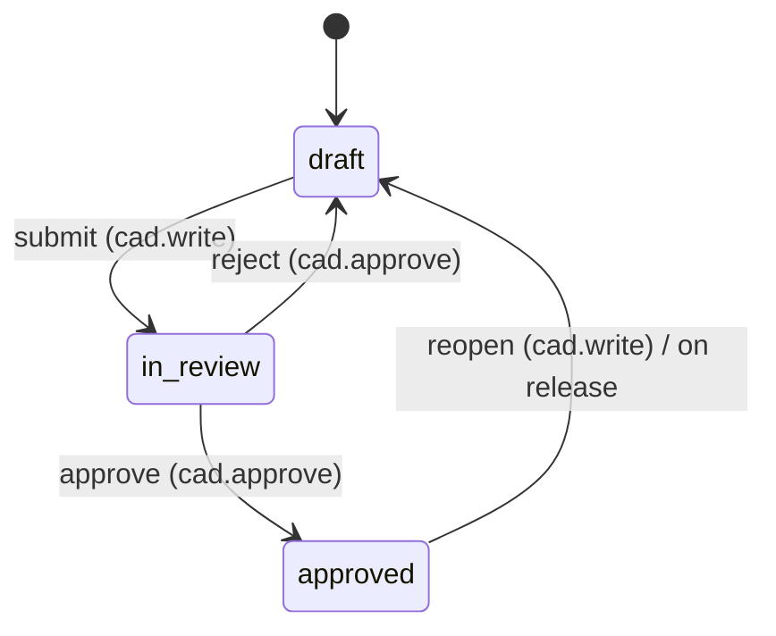

# Workflow & Review

> **System** ▸ [Overview](../00-overview.md) ▸ [VCS](../30-vcs.md) ▸ **Workflow & review**
> Related: [VCS subsystem map](./00-overview.md) · [Release & revisions](./release-revisions.md) · [Branches](./branches.md) · [Architecture: unified bindings](../architecture/unified-vcs-bindings.md)

---

## Requirements

| REQ | Status | Summary |
|-----|--------|---------|
| 703 | unapproved | Generic declarative workflow engine; permission-guarded transitions; state per repo |
| 704 | unapproved | CAD review states draft / in_review / approved; submit (cad.write), approve/reject (cad.approve) |
| 705 | unapproved | Release requires `approved`; on release the workflow returns to `draft` |
| 706 | unapproved | Transitions fire a best-effort notification event |
| 707 | unapproved | Editor shows current state + only the transitions available to the user |

### REQ 703 — Declarative engine

- **Description:** The system shall provide a generic, declarative workflow engine that drives permission-guarded state transitions defined per repository type, with the current workflow state stored per repository.
- **Rationale:** A reusable declarative engine replaces ad-hoc per-entity state columns and can later govern parts/harness/requirements by adding a transition table — not just CAD.
- **Verification:** Unit test: declarative transition table drives state changes; state persists per repo, defaults to initial.
- **Validation:** Workflow behaviour is defined in one declarative place and reused across entities.

### REQ 704 — CAD review workflow

- **Description:** A CAD model shall follow a review workflow with states draft, in_review, and approved and transitions submit (requires cad.write), approve and reject (require cad.approve); a transition shall be rejected when the user lacks the required permission or when it is not valid from the current state.
- **Rationale:** Design review/approval governance is required for a regulated QMS, and must be permission-separated (a reviewer approves, an editor submits).
- **Verification:** Unit/route test: submit (cad.write) draft→in_review, approve/reject (cad.approve); rejects without permission (403) or invalid-from-state (409).
- **Validation:** A CAD model is reviewed and approved by an authorized reviewer before release.

### REQ 706 — Best-effort notification

- **Description:** A workflow transition shall fire a notification event on a best-effort basis (for example, notifying reviewers on submit and the author on approval).
- **Rationale:** Stakeholders should be informed when a model needs review or has been approved, reusing the existing notification mechanism.
- **Verification:** Unit test: a transition invokes the notify hook with the transition + actor; a throwing hook does not fail the transition.
- **Validation:** Reviewers are alerted when a model awaits review and authors when their model is approved.

---

## Succinct description

`workflowEngine.js` is a generic, declarative state machine: a per-repoType transition table defines states and permission-guarded transitions, state is stored per repository in `VcsWorkflowState`, and `transition()` validates the move, checks permission, advances state, and fires a best-effort notification. CAD and assembly both use the same `draft → in_review → approved` definition.

---

## How it works — for everyone (non-technical)

A design moves through a few official stages: **draft** (being worked on), **in review** (someone is checking it), and **approved** (signed off). The rules for moving between stages live in one small table, so the same review process can later be reused for other things in the system, not just CAD.

The stages are gated by who you are. An editor can **submit** a draft for review. A separate reviewer can **approve** or **reject** it — deliberately a different permission, so the person who drew it isn't the person who signs it off. Try a move you're not allowed to make, or one that doesn't make sense from the current stage, and the system refuses.

When a stage changes, the system sends a courtesy notification (reviewers get pinged when something's waiting, the author gets pinged when theirs is approved). If that notification fails to send for some reason, the stage change still goes through — the alert is a nicety, not a gatekeeper. The editor only shows you the buttons for moves you're actually allowed to make right now.

---

## How it works — in detail (technical)

### The declarative table

`workflowEngine.js` defines `CAD_WORKFLOW`:

```text
initial: 'draft'
states:  ['draft', 'in_review', 'approved']
transitions:
  submit:  draft     → in_review   (cad.write,   notify: reviewers)
  approve: in_review → approved    (cad.approve, notify: author)
  reject:  in_review → draft       (cad.approve, notify: author)
  reopen:  approved  → draft       (cad.write)
```

`WORKFLOWS = { cad: CAD_WORKFLOW, assembly: CAD_WORKFLOW }` — assemblies share the same definition and the same `cad` permission resource. Adding a new entity's workflow is a single table entry.



### State storage (`VcsWorkflowState`)

State is a free-form string keyed by `(repoType, repoId)` in `VcsWorkflowStates`. Absence of a row means the workflow's `initial` state (`draft`). Because the key is free-form, the CAD controller composes `repoId = "<lineageRoot>:<branchName>"` (`workflowRepo`) so each branch has its own review state — no migration needed (see [Branches](./branches.md)).

### Engine operations

- `getState(repo)` — stored state, or the initial.
- `setState(repo, state, userId)` — direct upsert (used by release to reset to `draft`).
- `availableActions(repo, userId)` — transitions valid from the current state for which the user holds the permission (via `loadEffectivePermissions`). Drives the editor's transition buttons (REQ 707).
- `transition(repo, action, userId, ctx)` — finds a transition matching `action` from the current state, else **409**; checks the actor's permission, else **403**; advances state; then fires the notifier best-effort. **A failing notify never fails the transition** (REQ 706).
- `canRelease(repo)` — `state === 'approved'` (the release gate, REQ 705).

### Notifications

`_defaultNotifier` routes `notify: 'author'` transitions to `notificationService.sendPushToUser`. `setNotifier(fn)` makes the hook injectable so tests can observe it. The `'reviewers'` channel is a declared hook point.

### Release coupling (REQ 705)

For the legacy in-place release on `main`, the controller checks `workflowEngine.canRelease` (must be `approved`) and then `setState(..., 'draft')` so the next change starts a fresh review cycle. The self-service **branch → main** numeric release is *not* approval-gated; the workflow gate applies to the **production-letter** release (see [Release & revisions](./release-revisions.md)).

### Editor surface (REQ 707)

The cad-editor footer shows the current workflow state badge and renders only the transition buttons the current user is permitted from that state (driven by `availableActions`).

---

## Key files

- `backend/services/vcs/workflowEngine.js` — declarative engine (table, `transition`, `canRelease`, notifier)
- `backend/models/vcs/vcsWorkflowState.js` — `VcsWorkflowStates`, keyed per `(repoType, repoId)`
- `backend/api/design/cad-model/controller.js` — `workflowRepo` (per-branch key), workflow transition routes
- `frontend/src/app/components/cad/cad-editor/cad-editor.component.ts` — workflow state badge + transition buttons
