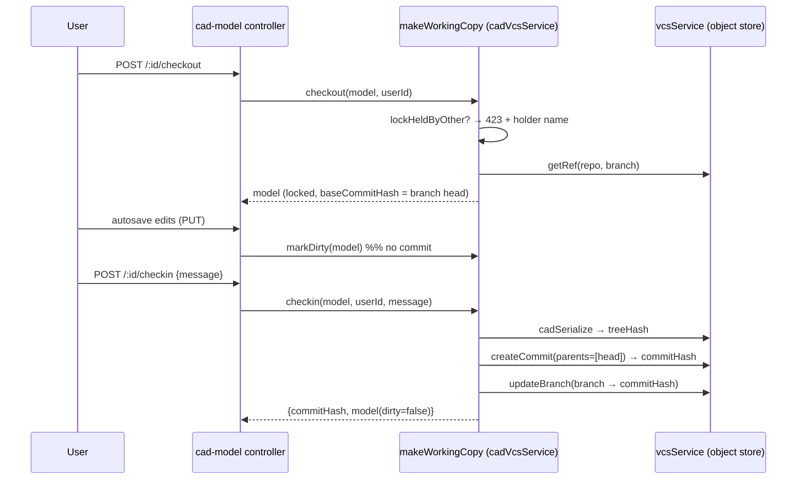

# Working Copy: Checkout / Check-in / Lock

> **System** ▸ [Overview](../00-overview.md) ▸ [VCS](../30-vcs.md) ▸ **Working copy**
> Related: [VCS subsystem map](./00-overview.md) · [Content-addressed store](./content-addressed-store.md) · [Branches](./branches.md) · [Architecture: unified bindings](../architecture/unified-vcs-bindings.md)

---

## Requirements

| REQ | Status | Summary |
|-----|--------|---------|
| 677 | unapproved | Working copy bound to a checked-out branch (branch + base commit + dirty) |
| 678 | unapproved | Checkout acquires an exclusive per-branch lock; others blocked with 423 naming the holder |
| 679 | unapproved | Lock expires after a timeout; holder-release; admin force-release |
| 680 | unapproved | Check-in requires lock + message; commits, advances branch, clears dirty |
| 681 | unapproved | Autosave persists edits without committing; commits only via check-in |
| 690 | unapproved | Checkout/check-in gated by CAD permissions (checkout needs cad.write) |
| 691 | unapproved | Editor shows lock holder + dirty state; check-in / checkout / release-lock controls + commit history |
| 725 | unapproved | Undo Checkout: discard uncommitted edits, roll back to branch head, release lock |
| 555 | unapproved | When a CAD model's releaseState is not 'draft', the CAD module shall reject any modifica |

### REQ 678 — Exclusive checkout lock

- **Description:** Checkout shall acquire an exclusive lock on the branch for the requesting user. While another user holds the lock, modifications to the working copy shall be rejected with HTTP 423 (Locked), naming the current lock holder.
- **Rationale:** Without locks, two editors on one model silently overwrite each other; PDM-style exclusive checkout serializes edits.
- **Verification:** Integration test: a second user is blocked with statusCode 423 while the lock is held.
- **Validation:** Two users cannot unknowingly clobber each other's edits; the second sees who holds the model.

### REQ 680 — Check-in

- **Description:** Check-in shall require the lock and a commit message, serialize the working copy into the object store, create a commit whose parent is the current branch head, advance the branch, and clear the dirty flag.
- **Rationale:** Check-in is the explicit, named snapshot operation; requiring the lock prevents concurrent commits; chaining to the branch head builds the history DAG.
- **Verification:** Integration test: check-in requires the lock, creates a commit chained to the prior head, advances the branch, clears dirty.
- **Validation:** A user saves a named version of their model that appears in history.

### REQ 681 — Autosave vs commit

- **Description:** Autosave shall continue to persist working-copy edits without creating commits; commits shall be created only by explicit check-in.
- **Rationale:** Preserves the existing no-data-loss autosave while making commits deliberate checkpoints rather than noise on every edit.
- **Verification:** Integration test: `markDirty` flags edits without committing; only check-in commits + clears dirty.
- **Validation:** Users never lose in-progress work, but history contains only meaningful, named versions.

---

## Succinct description

The `DesignCADModel` row *is* the editable working copy. `vcsWorkingCopy.makeWorkingCopy(binding)` provides the generic seed / checkout / check-in / undo / lock / history operations; `cadVcsService` binds them to the CAD document shape `{ featureTree, sketchDoc, equations }`.

---

## How it works — for everyone (non-technical)

A part's design has two layers: the **live working copy** you're actively editing, and the **permanent snapshots** in history. The working copy is like the document open on your desk; a snapshot is like a photocopy you file away.

To edit, you **check out** — which puts a lock on the part with your name on it, so nobody else can edit it at the same time. If someone else already has it checked out, you're told who, and the system refuses to let you change it. As you work, the system quietly **autosaves** so you never lose anything, but autosaves are not snapshots. When you reach a milestone you **check in** with a short message, which takes a permanent, named photocopy and files it.

If you decide your session was a mistake, **Undo Checkout** throws away everything since your last check-in and hands the lock back. And if someone checks out a part and then vanishes, the lock expires on its own after a while, and an administrator can force it open.

---

## How it works — in detail (technical)

### The working-copy row

`DesignCADModel` carries the VCS working-copy columns: `branchName`, `baseCommitHash`, `lockedByUserID` / `lockedAt` / `lockExpiresAt`, `dirty`, `releaseLocked`. The document body is `docOf(model) = { featureTree, sketchDoc, equations }` (`cadVcsService.docOf`).

### The factory binding

`makeWorkingCopy(binding)` (`vcsWorkingCopy.js`) is written once for every versioned document. The CAD binding (`cadVcsService.js`) supplies:

- `repoFor` → `repoForModel` (lineage-root repo);
- `docOf`, `serialize` → `cadSerialize`, `deserialize` → `cadDeserialize`;
- `applyDoc` → patches `{ featureTree, sketchDoc, equations }` back onto the model;
- `commitMeta` → `cadVersionInfo()` stamping `{ kernelVersion, namingVersion }` (REQ 683/VC-15) into each commit.

### Lock semantics

- `lockHeldByOther(model, userId, at)` — true only when a *different* user holds an *unexpired* lock. An expired lock (`lockExpiresAt` in the past) no longer blocks.
- `checkout` — refuses with `RestError(..., 423)` naming the holder's `displayName` when held by another; otherwise sets `lockedByUserID`, `lockedAt`, `lockExpiresAt = now + lockTtlMs`, points `baseCommitHash` at the branch head, and records `branchName`. The TTL defaults to `CAD_LOCK_TTL_MS` or 30 minutes (`DEFAULT_LOCK_TTL_MS`).
- `releaseLock(model, userId, { force })` — the holder can release; `force` lets an administrator override (`force-unlock` route is `cad.approve`-gated, REQ 679/690).
- `sweepExpiredLocks(at)` (in `cadVcsService`) — bulk-clears any lock whose `lockExpiresAt` has passed (stale-lock sweep, REQ 679).

### Check-in vs autosave

- **Autosave** persists edits to the row and flips `dirty` via `markDirty` — no commit (REQ 681).
- **Check-in** (`checkin`) requires the caller to hold the lock (else 423), serializes the working doc to a tree, creates a commit with `parents = [branch head]`, advances (or creates) the branch ref, then sets `baseCommitHash = commitHash, dirty = false` (REQ 680).

### Undo checkout (REQ 725)

`undoCheckout(model, userId)` requires holding the lock. It clears the lock fields and `dirty`, and — if a `baseCommitHash` exists — re-deserializes that commit's tree and applies it back over the working copy (`applyDoc`), restoring the last check-in. With no commits yet it simply unlocks (nothing to roll back to). The route is exposed at the editor's *Undo checkout / discard* control.

### Seed + history

- `seedMain(model, userId)` — commits the current doc to `main` with no parent and creates the `main` ref; a no-op returning the existing head if `main` exists. `main` is protected thereafter.
- `history(model)` — `vcs.log` for the working copy's branch, newest-first, or `[]` if the branch has no commits yet.

### Editor surface (REQ 691)

The cad-editor footer shows the dirty flag and a foreign-lock badge (read-only is extended while another user holds the lock), with **Check out**, **Check in** (message prompt), **Release lock**, and **Undo checkout** controls plus a commit-history panel. Visibility is driven by the lock holder and `cad.write`.

---

## Key files

- `backend/services/vcs/vcsWorkingCopy.js` — `makeWorkingCopy` factory (seed/checkout/checkin/undo/lock/history)
- `backend/services/vcs/cadVcsService.js` — CAD binding + `markDirty`, `sweepExpiredLocks`, thumbnail storage
- `backend/services/vcs/cadSerializer.js` — `cadSerialize` / `cadDeserialize` (document ⇄ tree)
- `backend/api/design/cad-model/controller.js` — checkout / checkin / release-lock / undo HTTP handlers
- `frontend/src/app/components/cad/cad-editor/cad-editor.component.ts` — footer lock/dirty UI + commit history
